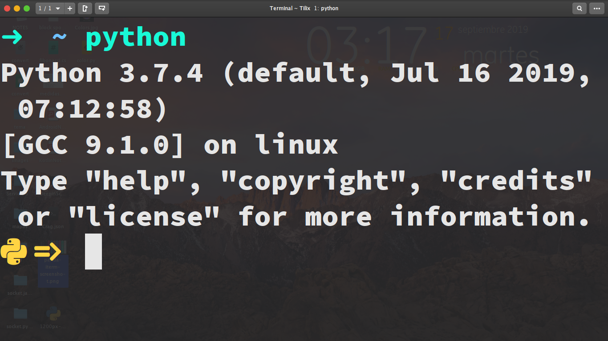

# beautiful_prompt_py
optional prompt for python
## requirements
* Nerdfonts
  https://www.nerdfonts.com/
* Colorama
"pip install colorama"
## Preview

## Install
* save .pyrc in $ HOME
* add in .zshrc or .bashrc "export PYTHONSTARTUP = ~ / .pyrc"
